# Electrum guide

## This is a guide for creating a 2 of 3 multisig wallet with Gordian Wallet and Electrum, building and signing the psbt with Electrum, then exporting the psbt to Gordian Wallet for signing and broadcasting

### 1. Create a multisig wallet in Gordian Wallet by selecting "multisig" -> "create wallet"

 

### 2. Save your recovery words, you will need them


### 3. Open Electrum and create a new mutlisig wallet


### 4. Choose a 2 of 3


### 5. Import your own seed (the recovery phrase from Gordian Wallet)


### 6. Its a BIP39 seed so you need to tap "options" and select "BIP39"


### 7. Add the recovery phrase from Gordian Wallet

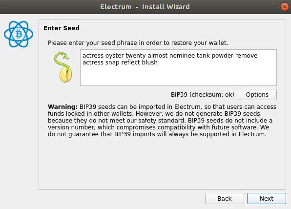

### 8. Confirm derivation - by default Gordian Wallet uses the same derivation as Electrum for multisig wallets, just make sure you select `native segwit multisig (p2wsh)`, this is also the default multisig address format used by Gordian Wallet (bech32)

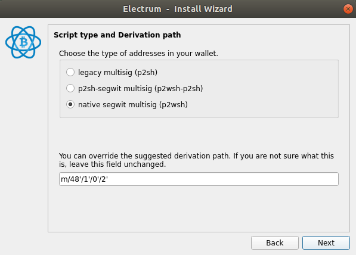

### 9. Electrum derives the extended public key for you to export which is derived from the recovery phrase you just added

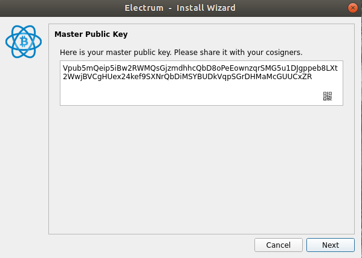

### 10. Enter cosigner #2


### 11. Come back to Gordian Wallet and export your 1st public key descriptor which holds all the xpubs you need. You can get this by going to the wallets tab, enabling the Electrum wallet, and tapping the "info" button to export the devices seed and public key descriptors.


When you export a public key descriptor from Gordian Wallet you will get two descriptors, the first one represents your primary addresses and the second descriptor represents your change addresses. The first one is what we need and will look like this:

```
wsh(sortedmulti(2,[82be8e74/48'/1'/0'/2']tpubDEYij9WndcWU4ApaSz68RitBMrZRTfShsXn4qw1izEaFScR5dnP4dz1CzgmfT5iTrNeZJhMXieg2BzhCFNxrWtvaTerBio3VbFoSDixs4yR/0/*,[5222e39c/48'/1'/0'/2']tpubDEQznV4Xs6BP1A1HXzogRsUiFxDsyaqLzphZmjmwrrERz9aHszb2juQzYBx9xuXymba5kkQvR76m218JiXM1DsLcgPryGCDs5P1geHoxVrx/0/*,[81202613/48'/1'/0'/2']tpubDEcrpYzpqTJyhy5bzsojvL8VMrcFf4DVU7q43fuq6JhhNyxCqLzhppiUsMHAXUJv4XTnmAiezNAzdfTdg2FFefbzNh8YzN6Wv2zEYwcCC22/0/*))#czsstq8d
```

It gives you 3 xpubs (tpubs for testnet):

**Gordian Wallet works with Bitcoin Core and Bitcoin Core only works with xpubs/tpubs. Therefore you will need to use [this tool](https://jlopp.github.io/xpub-converter/) to convert your xpubs to the format Electrum accepts.**

xpub #1 always represents your offline recovery keys - this is the one we already imported into Electrum via the offline recovery words. `tpubDEYij9WndcWU4ApaSz68RitBMrZRTfShsXn4qw1izEaFScR5dnP4dz1CzgmfT5iTrNeZJhMXieg2BzhCFNxrWtvaTerBio3VbFoSDixs4yR`

xpub #2 always represents your devices keys and will be the one we add into Electrum next. `tpubDDxd7u6V76WHV6CRy3KSsJoXiioVwubYDubysMkvkYuCTFPwWfUwcnC7yh1mNkMd13Ssh8Fu7UiSJRoELuKW58zrVBd1YRGfHkcF2s9DHz3`

xpub #3  always represents your nodes keys and will be the final key we add as a cosigner into Electrum. `tpubDFW7MhUGfWLHXafXcca9ow5jUkLukcxawpG7V6BzXgtsxHdkUKuSy5eXwrDZ7zr5jLHRmYnJoHv4GGAYY4HGK53x9BL2tDeePw4QNdkk6Gw`

Here's what it means (you do not *need* to know this but it is useful to understand):

- `wsh`: witness script hash. multisig sig bech32 address type, aka p2wsh (pay to witness script hash). It tells your node that this is a bech32 multisig address type.
- `sortedmulti`: This means the descriptor is describing a BIP67 multisig wallet which means the order of the public keys does not matter as they will always be derived lexicographically. Electrum, Coldcard and Specter all support BIP67.
- `2`: Represents the number of signatures required, it is folllowed by the xpubs, the number of xpubs denote the number of possible cosigners, in this case its a 2 of 3.
- `[48214714/48'/1'/0'/2']`: The xpubs derivation. You can think of the xpub as representing this derivation path.
- `/0/*` represents the addresses that the descriptor would import, in this case its the primary addesses. The `0` means the addresses will be primary receiving addresses, if this was a change descriptor it would be a `1`. The `*` just means it can import any range of keys making it HD and actually represents the index of the address to be derived.
- `#9650s8vz`: The descriptors checksum.

### 13. Take your #2 tpub from the primary descriptor and convert it to a Vpub (for testnet)


### 14. Paste it in to Electrum, tap next, repeat the process for the third and final xpup/tpub

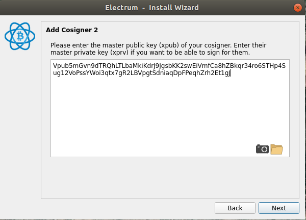

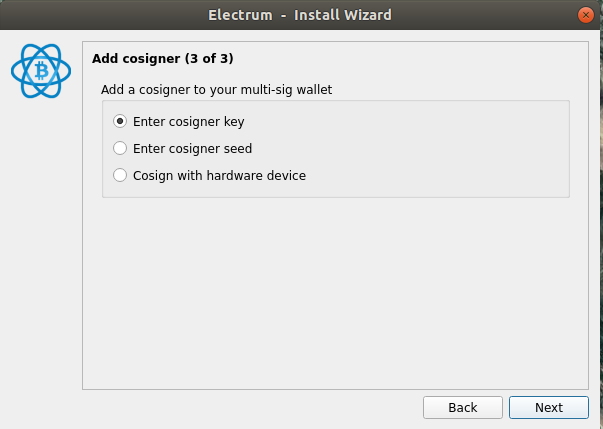

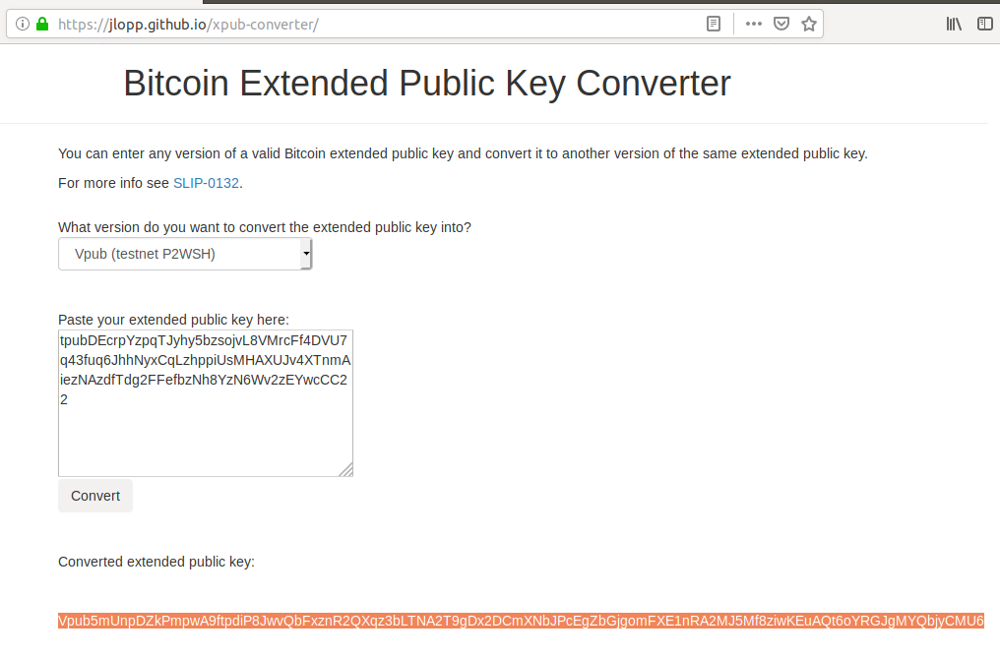

### 15. Bypass Electrums encryption (the nice thing about multisig is we don't need passphrases to maintain security)

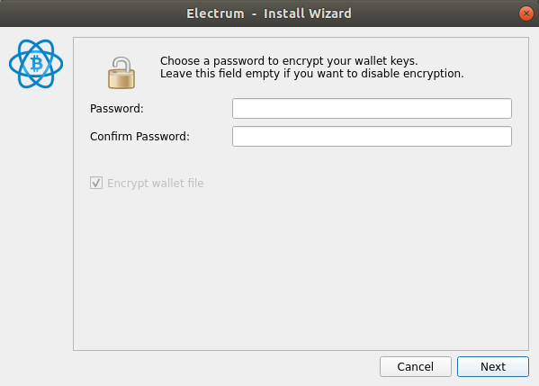

### 16. In Electrum export your addesses by tapping "view" -> "addresses" 


### 17. Open Gordian Wallet and go to the Electrum wallet in the wallets tab, tap the eye button to export your multisig keys. 

**Confirm the addresses match what Electrum produced! If they do not then something went wrong! Most likely you selected the wrong derivation type, added the incorrect xpub or converted the xpub to the incorrect format. This does work so try again and be careful to follow the instruction.**

Here we can see the addresses match what Electrum exported 🤩


### 18. Now the good part, use Electrum to receive some testnet bitcoins.

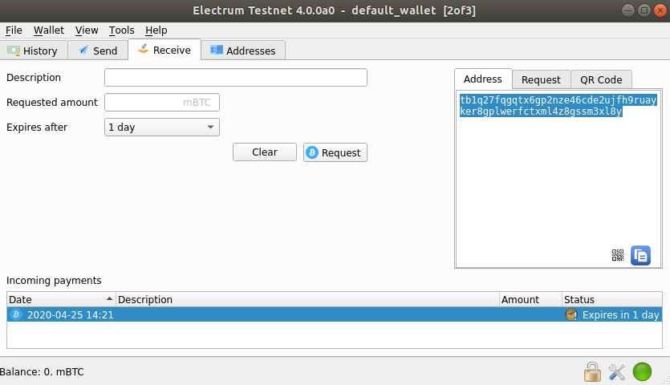

### 19. Confirm you received them - you can do this in both Gordian Wallet and Electrum

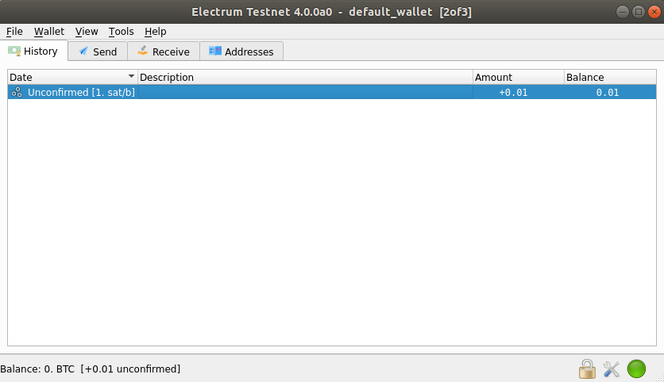

### 20. In Electrum create a PSBT

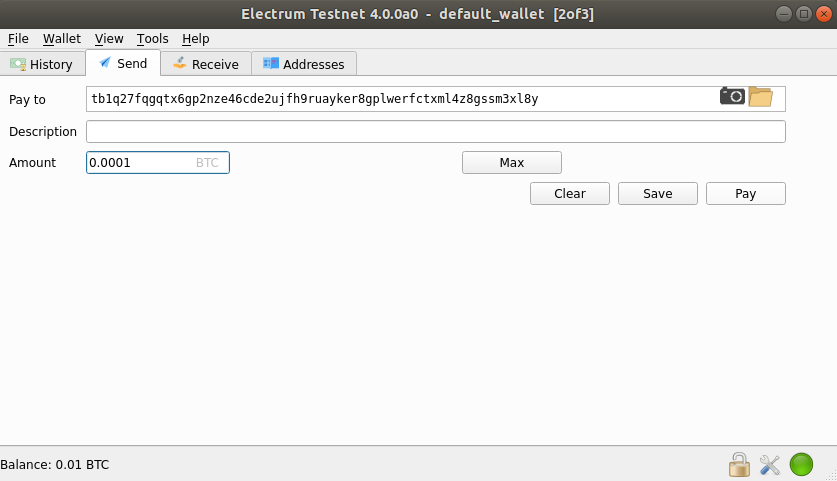

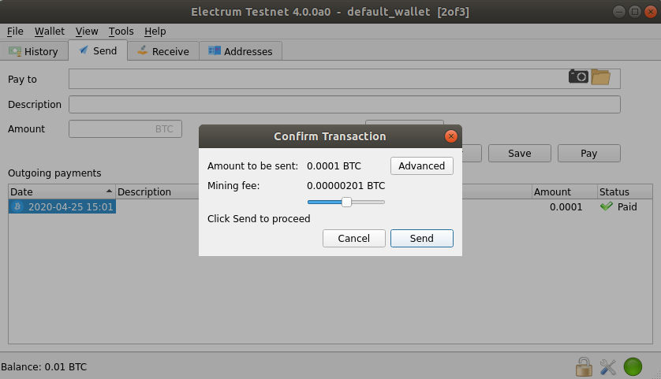

⚠️ **The following functionality is only available on Electrum if you build the master branch from source. Hopefully it will be avilable for download soon. You can still create the multisig wallets on Electrum but you won't be able to easily pass PSBT's from Electrum to any third party app.** ⚠️

### 21. Export the PSBT by clicking "export" in the bottom left -> "export to file". Take that file and send it to your iPhone, saving it in the "Files" app on your iPhone.


### 22. Open Gordian Wallet


### 23. Tap the folder icon in top left and tap the .psbt file you exported


### 24. Tap sign


### 25. Gordian Wallet will first pass it to your node for processing and signing, then Gordian Wallet will sign it locally with the seed that is on the device. It actually loops through all the seeds on your device and signs it if it can. Your current active node in Gordian Wallet must be on the same network as the transaction your trying to sign or it will fail.


### 26. At this point the psbt may still need more signatures or may be fully signed. If it is complete Gordian Wallet finalizes the psbt, converts it to a signed raw transaction and parses each input and output and displays the fee for you to confirm before broadcasting. If it is incomplete it will allow you to export the updated psbt as raw data file like the one we imported or as base64 so that you can pass the psbt to another signer.


### 27. Broadcast it


### 28. Open Electrum and you will see the transaction in your history and of course also in Gordian Wallet 🤯

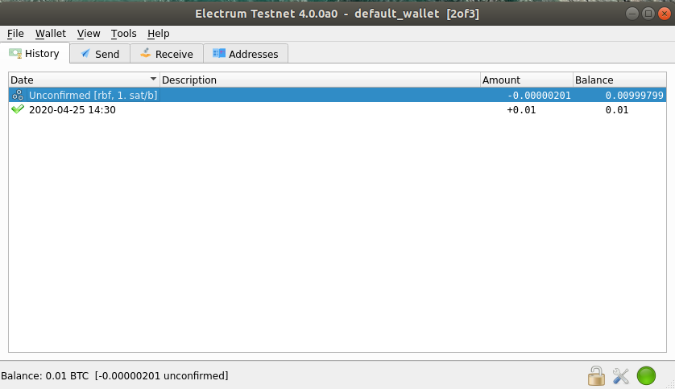


