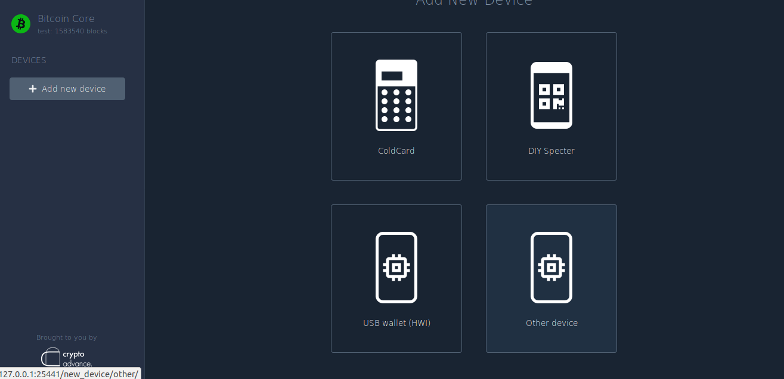
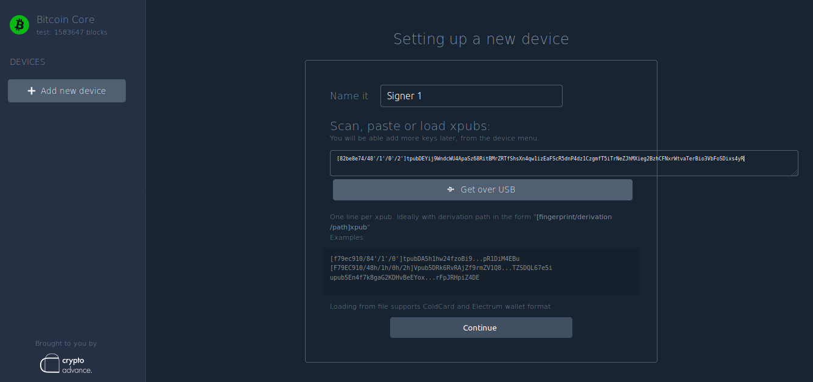
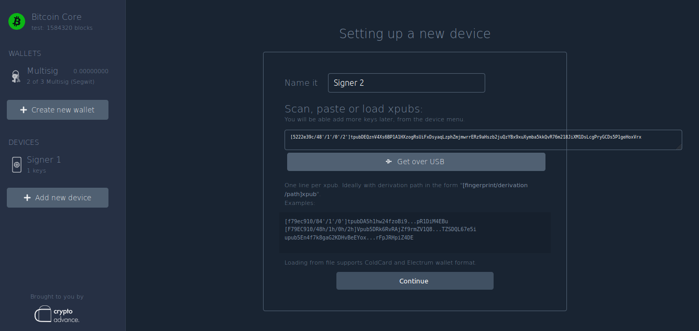
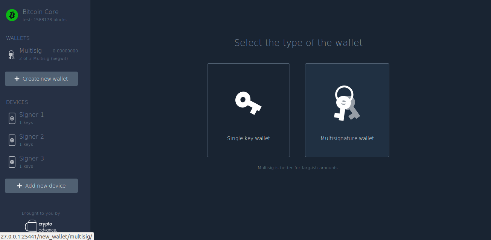
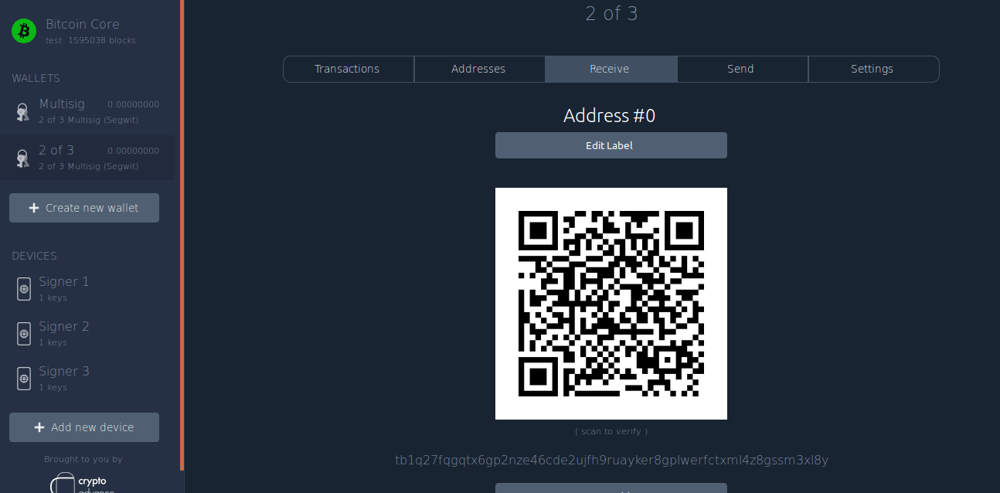
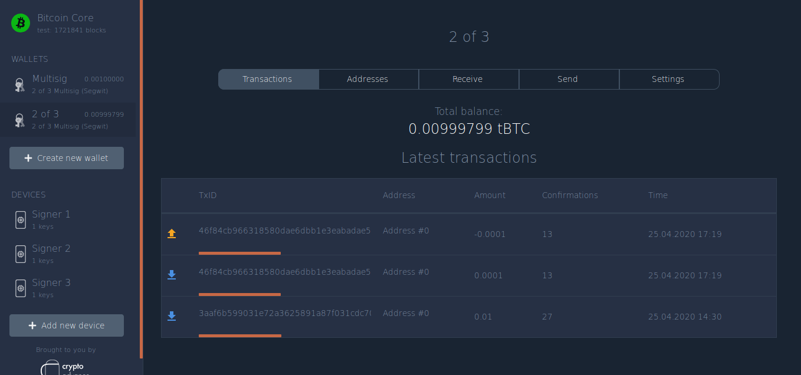
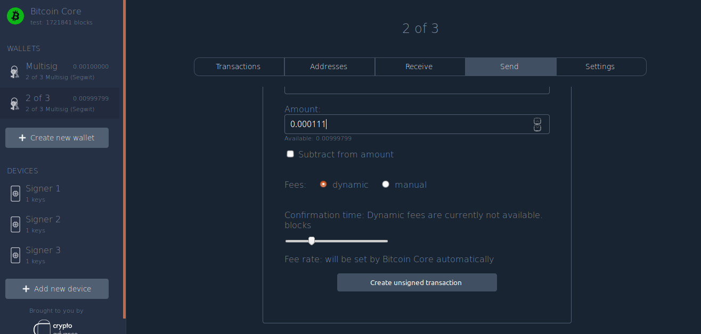
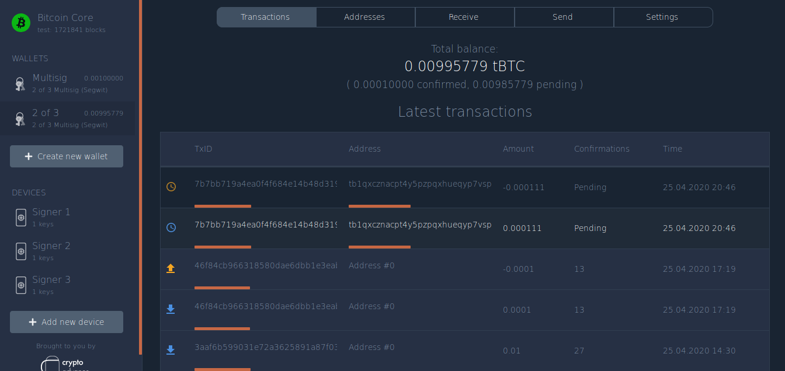

# Specter Guide

This is a guide for creating a 2-of-3 multisig wallet with Specter and FullyNoded 2.  It will show you how to add devices to Specter, create a multisig wallet, and build an unsigned PSBT with Specter, scanning the Specter PSBT QR code to sign it with FullyNoded 2 and broadcast with your node over Tor. 

It also shows you how to import a 2-of-3 multisig wallet from Specter simply by scanning the wallet import QR code that Specter exports. 

This guide is meant as a general usage example to show what is possible. Considering you can use Trezor, Coldcard, Electrum, and Specter DIY as signers too, you can see that this setup makes collaborative multisig easier then ever.

This guide was made using the same 2 of 3 setup that was used in the [Electrum guide](Electrum-guide.md) to illustrate how it can be used across platforms.

### 1. Add device #1 to Specter

You can think of devices as signers. In this case, we will add the three xpubs from a FullyNoded 2 multisig wallet.



### 2. Open FN2, get your xpubs by going to the wallets tab, activating a 2-of-3 wallet, and tapping the "info" button to export the "device seed info"

This will allow you to export the wallet's public key descriptors. For an explanation of exactly what this descriptor represents please read [this explainer](../Docs/Electrum-guide.md#11-come-back-to-fn2-and-export-your-1st-public-key-descriptor-which-holds-all-the-xpubs-you-need-you-can-get-this-by-going-to-the-wallets-tab-enabling-the-electrum-wallet-and-tapping-the-info-button-to-export-the-devices-seed-and-public-key-descriptors) from the [Electrum guide](../Docs/Electrum-guide.md).

 

### 3. Take the first descriptor (the primary one)

The original descriptor:

```
wsh(sortedmulti(2,[82be8e74/48'/1'/0'/2']tpubDEYij9WndcWU4ApaSz68RitBMrZRTfShsXn4qw1izEaFScR5dnP4dz1CzgmfT5iTrNeZJhMXieg2BzhCFNxrWtvaTerBio3VbFoSDixs4yR/0/*,[5222e39c/48'/1'/0'/2']tpubDEQznV4Xs6BP1A1HXzogRsUiFxDsyaqLzphZmjmwrrERz9aHszb2juQzYBx9xuXymba5kkQvR76m218JiXM1DsLcgPryGCDs5P1geHoxVrx/0/*,[81202613/48'/1'/0'/2']tpubDEcrpYzpqTJyhy5bzsojvL8VMrcFf4DVU7q43fuq6JhhNyxCqLzhppiUsMHAXUJv4XTnmAiezNAzdfTdg2FFefbzNh8YzN6Wv2zEYwcCC22/0/*))#czsstq8d
```

Remove the following sections:

- `wsh(sortedmulti(2,`
- `/0/*`
- `))#czsstq8d`

We need to do this because FullyNoded 2 works directly with Bitcoin Core and wants to maintain 100% compatibility with your node via the command line and console. Whereas Specter is clever and knows how to import what it needs with the minimum amount of information.

The descriptor will now look like:

```
[82be8e74/48'/1'/0'/2']tpubDEYij9WndcWU4ApaSz68RitBMrZRTfShsXn4qw1izEaFScR5dnP4dz1CzgmfT5iTrNeZJhMXieg2BzhCFNxrWtvaTerBio3VbFoSDixs4yR,[5222e39c/48'/1'/0'/2']tpubDEQznV4Xs6BP1A1HXzogRsUiFxDsyaqLzphZmjmwrrERz9aHszb2juQzYBx9xuXymba5kkQvR76m218JiXM1DsLcgPryGCDs5P1geHoxVrx,[81202613/48'/1'/0'/2']tpubDEcrpYzpqTJyhy5bzsojvL8VMrcFf4DVU7q43fuq6JhhNyxCqLzhppiUsMHAXUJv4XTnmAiezNAzdfTdg2FFefbzNh8YzN6Wv2zEYwcCC22
```

It has been stripped down to only the derivation paths and xpubs. Now, we have three xpubs that can be directly added to Specter as "devices".

When you create the multisig in FullyNoded 2 the xpubs represent three "devices" or "signers"

1. The first xpub is derived from your offline seed, this seed is supposed to be stored offline and only used for recovery. It represents the "emergency signer" which you would use to recover your wallet incase you lost one of your other seeds:

`[82be8e74/48'/1'/0'/2']tpubDEYij9WndcWU4ApaSz68RitBMrZRTfShsXn4qw1izEaFScR5dnP4dz1CzgmfT5iTrNeZJhMXieg2BzhCFNxrWtvaTerBio3VbFoSDixs4yR`

2. The second xpub is derived from your devices seed, so it represents your device as a signer:

`[5222e39c/48'/1'/0'/2']tpubDEQznV4Xs6BP1A1HXzogRsUiFxDsyaqLzphZmjmwrrERz9aHszb2juQzYBx9xuXymba5kkQvR76m218JiXM1DsLcgPryGCDs5P1geHoxVrx`

3. The third xpub is derived from your nodes seed (which as far as FN2 is concerned is deleted forever once the keys are imported into your node). You can think of this xpub as representing your node as a signer:

`[81202613/48'/1'/0'/2']tpubDEcrpYzpqTJyhy5bzsojvL8VMrcFf4DVU7q43fuq6JhhNyxCqLzhppiUsMHAXUJv4XTnmAiezNAzdfTdg2FFefbzNh8YzN6Wv2zEYwcCC22`

### 4. Now that we have our three xpubs formatted correctly for Specter we can add each one as an independent "device" into Specter

Just paste the xpub descriptor as they are listed above.






### 5. Now that we have our devices added to Specter we can create a watch-only multisig wallet



### 6. For now FullyNoded 2 only supports 2-of-3, so lets make it a 2-of-3


### 7. Now you can select the keys you want each device to use

Since each device only holds one key it's a simple decision.


### 8. ⚠️ Now the important part, click "receive" and check that the address matches what FullyNoded 2 exports ⚠️



### 9. Open FullyNoded 2 and tap the "eye" icon, which derives your addresses locally, so you can verify they match.

They do! 🤩

 

**If for some reason they do not match go back and start over! You most likely entered the incorrect xpub. Since Specter and FullyNoded 2 support BIP67 the order of the xpubs does not matter.**

### 10. This is the same wallet we used in the Electrum guide so it already has transaction history

You should verify the transactions match up in FullyNoded 2, Specter, and anywhere else you have used this wallet. 



### 11. Now create a PSBT with Specter by clicking "Send"





### 12. Scan the PSBT QR code with FullyNoded 2 to sign it and broadcast it

* If FullyNoded 2 can not sign for all of the required signatures to spend the PSBT then it will simply sign what it can and export the PSBT in a few different formats for you to pass on to other signers. 
* If it can sign for all the required signatures it will finalize the PSBT which converts it into a signed raw transaction, verifying each input and output for your confirmation, allowing you to broadcast it with your node over Tor.

 

### 13. Check the transaction history in Specter to see that it matches FullyNoded 2



It does! (and Electrums and Bitcoin Cores!) 🤩

### 14. BONUS Section! 

Not only can you import FullyNoded 2 wallets into Specter, but you can also create wallets with other devices on Specter, then import those wallets into Fully Noded simply by clicking "Settings" in Specter and scanning the "wallet import/export" QR code. **This currently only works for 2-of-3 bech32 multisig wallets as far as FullyNoded 2 is concerned. More wallet types can be supported in the future. Consider sponsoring us to continue further development.**


Try it yourself simply by scanning this QR code with Fully Noded 2. You will need to go to "wallet tools" and rescan the blockchain for the transactions to show up.


